# trickle-react

**React hooks for streaming structured output from LLMs — a typed object that fills in live, with per-field loading status.**

<p>
  <a href="https://www.npmjs.com/package/trickle-react"></a>
  <a href="https://github.com/H1manshu01/trickle-react/actions/workflows/ci.yml"></a>
  <a href="https://bundlephobia.com/package/trickle-react"></a>
  
  <a href="./LICENSE"></a>
</p>



Every AI chat or agent UI re-wires the same plumbing: open a stream, parse the
half-finished JSON on every chunk, render each field as it arrives, show a
per-field loading state, and validate at the end. `trickle-react` is that
plumbing as one hook — you give it a schema and a stream, and you get a typed
object that fills in live.

```tsx
import { z } from "zod";
import { sse } from "sse-wire";
import { useStreamingObject, openAIContent } from "trickle-react";

const Profile = z.object({ name: z.string(), city: z.string(), bio: z.string() });

function ProfileCard({ prompt }: { prompt: string }) {
  const { data, status, done } = useStreamingObject(
    Profile,
    (signal) =>
      openAIContent(
        sse("https://api.openai.com/v1/chat/completions", {
          method: "POST",
          headers: { authorization: `Bearer ${KEY}`, "content-type": "application/json" },
          body: JSON.stringify({
            model: "gpt-4o",
            stream: true,
            response_format: { type: "json_object" },
            messages: [{ role: "user", content: prompt }],
          }),
          signal,
        }),
      ),
    { deps: [prompt] },
  );

  return (
    <article>
      <h2>{data.name ?? <Skeleton />}</h2>
      <p data-loading={!status.city}>{data.city}</p>
      <p data-loading={!status.bio}>{data.bio}</p>
      {done && <Badge>complete</Badge>}
    </article>
  );
}
```

`data` is a `DeepPartial<T>` that updates on every chunk; `status.field` turns
`true` once that field has arrived and won't change again; `done` flips when the
stream completes. The stream is aborted automatically on unmount or when `deps`
change.

## Why another one?

Streaming a *structured* object (not just text) into a UI means parsing JSON
that is syntactically broken until the last token, then knowing which fields are
settled. The existing options are tied to one SDK or one provider:

| | trickle-react | Vercel AI SDK `useObject` | Hashbrown | TanStack AI |
|---|:---:|:---:|:---:|:---:|
| Works with any stream source | ✅ | ⚠️ AI SDK routes | ⚠️ | ⚠️ |
| Provider-agnostic | ✅ | ⚠️ | ⚠️ | ⚠️ |
| Per-field loading status | ✅ | — | — | — |
| Typed `DeepPartial<T>` | ✅ | ✅ | ⚠️ | ⚠️ |
| Streaming list + tool calls | ✅ | ⚠️ | — | ⚠️ |
| Built on a reusable, zero-dep suite | ✅ | — | — | — |

See [COMPETITORS.md](./COMPETITORS.md) for the full scan.

## Where it fits

`trickle-react` is the adoption layer over a four-package streaming
structured-output suite (same author) — it ties the whole pipeline into hooks:

```
fetch → SSE (sse-wire) → parse partial JSON (trickle-json) → repair/coerce (coerce-json) → render (trickle-react)
```

- [`sse-wire`](https://www.npmjs.com/package/sse-wire) — fetch-based SSE (POST + headers).
- [`trickle-json`](https://www.npmjs.com/package/trickle-json) — incremental partial-JSON parser (the engine this is built on).
- [`coerce-json`](https://www.npmjs.com/package/coerce-json) — schema repair/coercion for the final value.

You don't need all of them — `trickle-react` only depends on `trickle-json`.
Bring `sse-wire` for the stream and `coerce-json`/`zod` for validation if you
want them.

## Install

```sh
npm install trickle-react
```

`react` (>= 18) is a peer dependency. `zod` and `coerce-json` are **optional**
peers. Ships ESM + CJS + `.d.ts`, ~1.5 kB min+brotli (excluding React and
trickle-json).

## API

### `useStreamingObject(schema, startStream, options?)`

```ts
const { data, status, done, error, abort } = useStreamingObject(schema, startStream, options);
```

- **`schema`** — a Zod schema (infers `T` and validates the final value) or `null`.
- **`startStream`** — `(signal: AbortSignal) => AsyncIterable<string | Uint8Array> | Promise<…>`.
  Yields the JSON text chunks as they stream. The `signal` aborts on unmount / `deps` change / `abort()`.
- **`options`** — see the table below.

Returns `data` (`DeepPartial<T>`, fills in live), `status` (per-field readiness),
`done`, `error`, and `abort()`. Built on `useSyncExternalStore`, so renders are
tearing-free and React 18 concurrent-safe.

### `useStreamingList(startStream, options?)`

```ts
const { items, done, error, abort } = useStreamingList<Suggestion>(startStream, { path: "suggestions" });
```

Streams a JSON array and exposes `items` (a `DeepPartial<T>[]`) that grows and
whose tail fills in as rows arrive. `path` is a dot-path to the array within the
streamed object (omit it if the root is the array). Takes the same options as
`useStreamingObject` (minus `validate`).

### `useToolCalls(startStream, options?)`

```ts
const { toolCalls, done, error, abort } = useToolCalls((signal) =>
  sse("/api/agent", { method: "POST", body, signal }),
);
// toolCalls[0].name, toolCalls[0].arguments (fills in live)
```

Streams OpenAI tool/function calls, with each call's `arguments` parsed
best-effort as the fragments arrive. Here `startStream` yields **SSE events**
(e.g. straight from `sse-wire`). Each `StreamedToolCall` is
`{ index, id?, name?, arguments }`. Built on trickle-json's `streamOpenAIToolCalls`.

### Provider glue

Plain async generators that adapt an SSE event stream into the text chunks
`useStreamingObject` wants:

- **`openAIContent(events, { done? })`** — extracts `choices[0].delta.content`.
- **`anthropicText(events)`** — extracts `text_delta` / `input_json_delta`.
- **`fromSSE(events, { done? })`** — yields raw `data` payloads, stopping at the sentinel (default `"[DONE]"`). Use when the `data` lines are already the JSON.

### Helpers

- **`computeStatus(data, done)`** — the per-field readiness derivation.
- **`selectPath(data, "a.b")`** — read a dot-path out of a value.

## Options

| Option | Default | What it does |
|---|---|---|
| `enabled` | `true` | Start the stream only when true. |
| `deps` | `[]` | Re-open the stream when any of these change (like an effect dependency list). |
| `validate` | `true` | Run the schema's `safeParse` on the final value (object hook only). |
| `onDone` | — | Called once with the final value on success. |
| `onError` | — | Called if the stream fails (not on abort). |

## Guardrails

- **No tearing.** State is read through `useSyncExternalStore`, so every render
  sees a consistent snapshot even under React 18 concurrent rendering.
- **Cleans up.** The stream is aborted on unmount, when `deps` change, or via
  `abort()` — no leaked fetches or readers (when the source honors the signal).
- **Aborts aren't errors.** Cancelling never surfaces as `error`.
- **Best-effort, never invented.** `data` is only ever what the parser has seen;
  `status.field` is conservative (the still-streaming tail field isn't "ready").

## Full-suite composition

```tsx
import { z } from "zod";
import { sse } from "sse-wire";
import { useStreamingObject, openAIContent } from "trickle-react";

const Recipe = z.object({
  title: z.string(),
  servings: z.number(),
  ingredients: z.array(z.string()),
});

function Recipe({ dish }: { dish: string }) {
  const { data, status, done, error } = useStreamingObject(
    Recipe,
    (signal) =>
      openAIContent(
        sse("/api/recipe", { method: "POST", body: JSON.stringify({ dish }), signal }),
      ),
    { deps: [dish], onError: (e) => toast(e.message) },
  );

  if (error) return <Error retry />;
  return (
    <>
      <h1 data-loading={!status.title}>{data.title}</h1>
      <Servings value={data.servings} loading={!status.servings} />
      <ul>{(data.ingredients ?? []).map((ing, i) => <li key={i}>{ing}</li>)}</ul>
      {done && <SaveButton recipe={data} />}
    </>
  );
}
```

`sse-wire` opens the POST stream, `openAIContent` pulls the JSON out of the
OpenAI envelope, and `useStreamingObject` (via `trickle-json`) turns it into a
profile that fills in — validated against the Zod schema at the end.

A runnable component is in [`examples/profile.tsx`](./examples/profile.tsx).

## Development

```sh
npm install
npm test          # vitest + @testing-library/react (jsdom)
npm run typecheck
npm run build     # tsup → ESM + CJS + .d.ts
npm run size      # size-limit
npm run lint      # Biome
npm run smoke     # cross-runtime smoke (Node + Bun), exports + non-React helpers
```

## License

MIT © Himanshu Sharma
